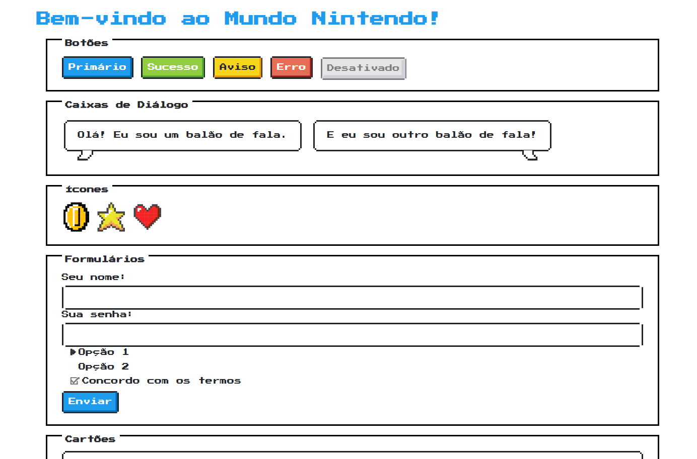

# Exemplo de site usando o framework CSS NES.css

Este fw tem o objetivo de prover um visual nintendista :D

## Links 

https://nostalgic-css.github.io/NES.css/

https://github.com/nostalgic-css/NES.css

## Este demo online
Para ver um pouquinho de interatividade e coisas se movendo, pode espiar aqui:
[Link do deploy na Vercel](https://demo-ness-css.vercel.app/)

Referência cruzada no Notion: https://rafaellindemann.notion.site/NES-css-Framework-pra-deixar-o-site-com-cara-de-nintendinho-19ad393ff68e807aadcec1b64ffc51e3?pvs=4